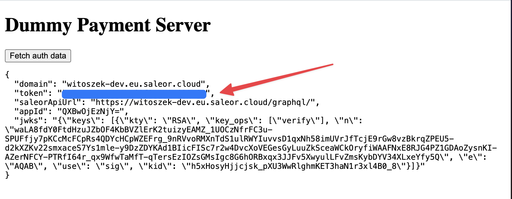

# Dummy Payment Server

Testing Saleor Transaction API without a real payment provider

## Installation

### Deno

This project requires Deno to be installed. It's a JavaScript backend runtime, similar to Node.js. [Follow official installation instructions](https://deno.land/manual@v1.36.0/getting_started/installation) if Deno is not installed on your system

### Running app

Pre-cache dependencies:

```bash
deno cache --reload main.ts
```

Start app:

```
deno task start
```

### Tunnel

> [!TIP]
> Before you go ahead and start your app locally, give [Deno Deploy](https://deno.com/deploy) a try! It's a serverless deployment environment (like Vercel, AWS Lambda). It's super fast, it takes a ~2 seconds to deploy the app after you push the changes to the repository 😉

Create a tunnel, to make your app accessible from Internet. You can use [Cloudflare Tunnel](https://developers.cloudflare.com/cloudflare-one/connections/connect-networks/install-and-setup/tunnel-guide/local/):

```
cloudflared tunnel --url localhost:5544
```

or by using ngrok:

```
ngrok http 5544
```

> [!WARNING]
> Saleor CLI's tunnel doesn't work with Deno

### Install app

After running a tunnel, install the app in Saleor.

- In Dashboard: go to Apps > Install external app
- In CLI: `saleor app install`

** The manifest URL is: your tunnel URL + `/manifest`**.

For example, if your tunnel URL is `https://happy-tunnel.com` then the manifest URL will be `https://happy-tunnel.com/manifest`

After installation, `auth_token` will be visible in the console. It is also stored inside `.token` file.

## Deployment

Fork this project

Use [Deno Deploy](https://dash.deno.com/projects) to deploy your forked repository.

### Updating deps cache

In case dependencies cache doesn't match due to some external changes in npm, run this command to update the cache hashes:

> [!TIP]
> If you receive a following error message:
>
> ```
> error: The source code is invalid, as it does not match the expected hash in the lock file.
> ```
>
> Then you need to run the following command

```bash
deno cache --lock=deno.lock --lock-write main.ts
```

## Example usage

The app ID is `witoszekdev.dummy-payment-app`.

The app has excessive permissions for debug purposes. They can be modified inside `main.ts` file.

Below you will find example mutations that can be used to fully go through the payment flow in Saleor: from requesting API key from app to initialize storefront (`paymentGatewayInitialize`), through making a payment (`transactionInitialize`) and confirming it with a two-step authorization (like 3D secure) (`transactionProcess`) to reporting a success / failure by the payment provider (`transactionEventReport` POST request to app)

### App token

If you would like to impersonate the app, you can do that by visiting the app page in Saleor Dashboard. You will be able to copy the app token from there



### Bruno

[Bruno](https://docs.usebruno.com/) is an open source tool for exploring and testing APIs. It's similar to Postman or Insomnia.

It can be used for testing the Transactions API in Saleor with the provided example requests.

In order to send requests from Bruno, you must create an **environment**. You can find the variables needed in `environments/localhost.bru` that works with Saleor that's running locally in [Saleor Platform](https://github.com/saleor/saleor-platform)

### `paymentGatewayInitialize`

```graphql
mutation GatewayInitialize($id: ID!) {
  paymentGatewayInitialize(
    id: $id
    paymentGateways: [{ id: "witoszekdev.dummy-payment-app" }]
  ) {
    gatewayConfigs {
      id
      data
      errors {
        field
        message
        code
      }
    }
    errors {
      field
      message
      code
    }
  }
}
```

Variables:

```json
{
  "id": "<checkout_id>"
}
```

### `transactionInitialize`

```graphql
mutation TransactionInitalize(
  $amount: PositiveDecimal
  $checkoutId: ID!
  $data: JSON
) {
  transactionInitialize(
    amount: $amount
    id: $checkoutId
    paymentGateway: { id: "witoszekdev.dummy-payment-app", data: $data }
  ) {
    transaction {
      id
      actions
      message
      pspReference
    }
    data
    errors {
      field
      message
      code
    }
  }
}
```

Variables:

```json
{
  "checkoutId": "<checkout_id>",
  "amount": 100 // your checkout amount
  "data": {
    "final": true
  }
}
```

When you provide `data.final = true`, then the app will return `CHARGE_SUCCESS` response, otherwise it will return `CHARGE_REQUESTED`.

### `transactionProcess`

```graphql
mutation TransactionProcess($transactionId: ID!) {
  transactionProcess(data: {}, id: $transactionId) {
    transaction {
      id
    }
    transactionEvent {
      id
      createdAt
      pspReference
      message
      externalUrl
      amount {
        currency
        amount
      }
      type
    }
    data
    errors {
      field
      message
      code
    }
  }
}
```

Variables:

```json
{
  "transactionId": "<transaction id from transactionInitialzie>"
}
```

### transactionEventReport

Make a POST request to `<APP_URL/transaction-event-report` with variables that are passed to `transactionEventReport` mutation in file `mutations.ts`:

```json
{
  "amount": "amount of the reported envet",
  "availableActions": ["REFUND", "CHARGE", "CANCEL"],
  "id": "id of the transaction",
  "messae": "message from the payment provider",
  "pspReference": "pspReference from the payment provider",
  "type": "CHARGE_SUCCESS"
}
```

The request must be authenticated with the app token that you can see in Saleor Dashboard

## TODO

- CLI for getting app auth data
- Simulation of async and sync flow
  - Sync: request refund -> return pspReference -> send transactionEventReport after x seconds
  - Async: request refund -> retrun success
